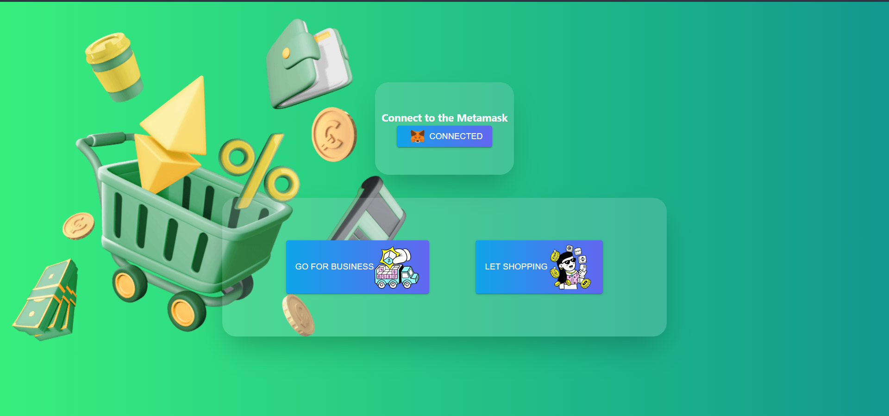
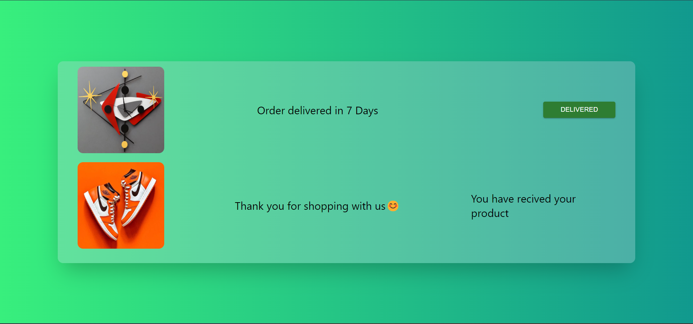

<!-- About this project -->

# **🚀Web3.0 E-commerce Shop 🛒🏪🏬🛍️**
This is an e-commerce shop build completely with **Blockchain** technology. It's build on Ethereum Blockchain. Here you can register your products for sale, also buy some listed products from store. You have to confirm the purchases in order to complete the transaction.


<p align="center">
  
</p>


## Build with🚀
* [Solidity](https://docs.soliditylang.org/)
* [Hardhat](https://hardhat.org/getting-started/)
* [React.js](https://reactjs.org/)
* [Next.js](https://nextjs.org/)
* [Typescript](https://www.typescriptlang.org/)
* [Tailwind](https://tailwindcss.com/)
* [ethers.js](https://docs.ethers.io/v5/)
* [Pinata](https://www.pinata.cloud/)


<!-- User manual -->


# User Manual

## Marketplace

<hr>
<hr>

### **Entry Page 🙏**

 This is the 1st page of this Dapp, where you can choose wheather you wanna do business with us or go for shopping.

 <p align="center">
  
 </p>

### **Marketplace Page 🛒**

This is the main Marketplace of our dapp. Here you can see all the listed products. You can see here your listed products too. From here you can buy the products you need by clicking them.

### **Product Description Page 🧾**

When you click individual products on Marketpalce, it leades you to product description page. 

 <p align="center">
  
 </p>

 From here you can buy each products by clicking **Buy** button. If you are the one who listed the product, then it shows **You are the owner of the product**.

 ### **Buy Page 💸💰💳**

 For buying a product, you first go to description page. There if you click **BUY** button, it takes you buy page.

 <p align="center">
  
 </p>

 Here you have to select how many products you want to buy and the delevery address. The total costs are showing in bellow of the item image. Hit **BUY** for buy the product.

 ### **Items Collection Page 🛍️**

 All the products you have owned till now are shown here. you can go there by clicking **My Products** option in nav bar inside Marketplace.

 <p align="center">
  
 </p>

 If the product delivered to you, you can click **DELIVERED** button to claim the ownership of the product.

 ## Business

 <hr>
 <hr>

 ### **List Product Page 📜**

 Here you can list your products with just **0.01** ether listing prize.

 <p align="center">
  
 </p>

 First you have to select a picture for you product, then give it a title & description. After you have to write the number of stock & finally write the price and click **List Product** . It can list your product into Marketplace.

 ### **Listed Product Page 🛒**

 If you click to the **My Products** button on the nav bar, you can go to the Listed Product page. Here you can see all of your listed products. If you click on them, it takes you another page, where you can see an Image and a button **My Customers**. If you don't have any customers, it shows you nothing, but if you do have any customers, then it gives the metamask address of that customer and a button **SHOW ME ADDRESS**, after clicking it a window should pop-up by saying the delivery address of the customer.

 <p align="center">
  
 </p>

<!-- USER GUIDE -->

## **How To Run** 

### **Prerequisites**

Please install or have installed the following:
* [nodejs](https://nodejs.org/en/download/) and [npm](https://www.npmjs.com/)
* [MetaMask](https://chrome.google.com/webstore/detail/metamask/nkbihfbeogaeaoehlefnkodbefgpgknn) Chrome extension installed in your browser
* [Hardhat](https://hardhat.org/getting-started/) For scripts and tests
* Create an account on [Pinata](https://www.pinata.cloud/), from their get the **Pinata Secret Key**

After going through all the installation and setup steps, you'll need to download all the dependencies by running: 
  ```sh
   cd Ecommarce--Web3--Dapp
   npm install
   ```
   This download all the needed dependencies. Then run following : 

   ```sh
   npx hardhat run --network localhost .\scripts\deploy.js
   ```
  This will create an artifacts folder.

  ```sh
   cd client
   npm install
   ```
  To run the frontend
  ```sh
   cd client
   npm run dev
   ```
  Go back to SendETH folder and run following
  ```sh
   cd ..
   npx hardhat node
   ```
  Now for deploy it into goerli network run
  ```sh
   npx hardhat run scripts/deploy.js --network goreli
  ```

## Contributing
Feel free to contribute by sending a PR. 
